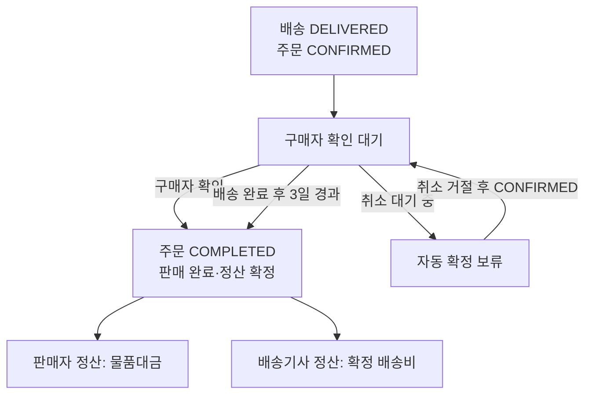

# 판매 완료·정산 정책

배송 완료 이후 판매 완료와 정산이 확정되는 시점을 정의한다. 결제 금액과 배송비는 [결제 정책](payment.md)을 따른다.

## 상태 목록

- 주문: 판매 완료 `COMPLETED`. 주문 상태 전이는 [주문 정책](order.md#주문-상태-전이)을 따른다.
- 정산: 정산 대기, 정산 확정, 정산 취소. 정산 상태는 주문 상태로 두지 않고 판매자·배송기사별로 정산 영역에서 관리한다.

## 목차

- [완료 및 정산 확정](#완료-및-정산-확정)
- [정산 상태](#정산-상태)
- [후순위 정책](#후순위-정책)

## 완료 및 정산 확정

- 배송 상태가 `DELIVERED`가 된 것만으로 판매 완료와 정산을 확정하지 않는다.
- 구매자가 배송 완료를 확인하면 판매 완료와 판매자·배송기사 정산을 확정한다.
- 구매자가 확인하지 않으면 배송 완료 시점부터 3일 후 자동으로 판매 완료와 정산을 확정한다.
- 구매자 확인과 자동 확정은 주문이 `CONFIRMED`이고 배송이 `DELIVERED`일 때만 한다. 판매 완료되면 주문은 `COMPLETED`가 되고 매물은 판매 완료가 된다.
- 취소 대기 중(`CANCEL_PENDING`)인 주문은 자동 확정하지 않는다. 취소가 거절되어 `CONFIRMED`로 돌아오면 확정 대상이 된다. 3일 기한은 배송 완료 시점 기준이며 취소 요청으로 늘어나지 않는다.
- 판매자 정산액은 물품대금, 배송기사 정산액은 확정 배송비다.

## 정산 상태

- 판매 완료 전의 정산은 정산 대기다. 판매 완료되면 정산 확정, 판매 완료 전에 주문 취소가 확정되면 정산 취소가 된다.
- 판매 완료와 정산 확정은 같은 시점이므로 주문에 정산 완료 상태를 따로 두지 않는다.
- 실제 지급(계좌 이체)은 하지 않는다. 판매자·배송기사의 출금 가능 금액은 확정된 정산의 합계다.

## 후순위 정책

- 수수료 정책
- 정산 지급(계좌 이체)과 지급 주기
- 판매 완료 후 반품·환불
