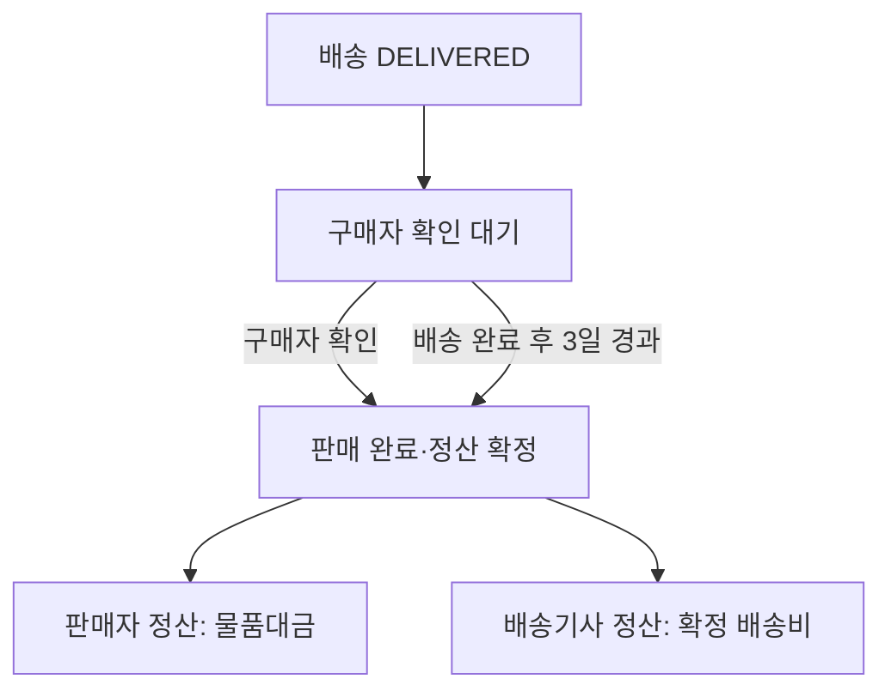

# 판매 완료·정산 정책

배송 완료 이후 판매 완료와 정산이 확정되는 시점을 정의한다. 결제 금액과 배송비는 [결제 정책](payment.md)을 따른다.

## 상태 목록

- 업무 단계: 구매자 확인 대기, 판매 완료·정산 확정. 별도의 상태값 이름은 이 정책에서 정의하지 않는다.

## 목차

- [완료 및 정산 확정](#완료-및-정산-확정)
- [후순위 정책](#후순위-정책)

## 완료 및 정산 확정

- 배송 상태가 `DELIVERED`가 된 것만으로 판매 완료와 정산을 확정하지 않는다.
- 구매자가 배송 완료를 확인하면 판매 완료와 판매자·배송기사 정산을 확정한다.
- 구매자가 확인하지 않으면 배송 완료 시점부터 3일 후 자동으로 판매 완료와 정산을 확정한다.
- 판매자 정산액은 물품대금, 배송기사 정산액은 확정 배송비다.

## 후순위 정책

- 수수료 정책
