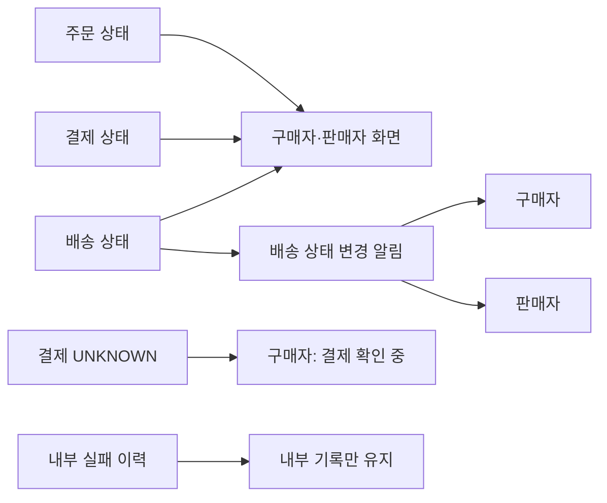

# 고객 상태·알림 정책

거래 진행 정보를 고객에게 보여 주고 알리는 범위를 정의한다.

- 주문·결제·배송 상태를 구매자와 판매자에게 노출한다.
- 내부 실패 이력은 사용자에게 노출하지 않는다.
- 결제 결과가 `UNKNOWN`이면 구매자에게 **결제 확인 중**으로 표시한다. 이때 재결제는 [결제 정책](payment.md#결과-미확정)에 따라 차단한다.
- 배송 상태 변경 현황을 구매자와 판매자에게 알린다.

## 잠정 채택

- 주문 만료 후 뒤늦은 승인 취소의 결과가 미확정이면 구매자에게 **취소 확인 중**으로 표시한다.
