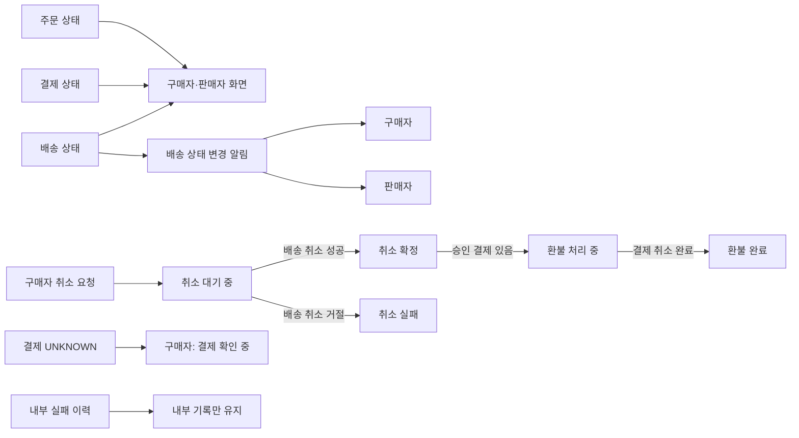

# 고객 상태·알림 정책

거래 진행 정보를 고객에게 보여 주고 알리는 범위를 정의한다.

- 주문·결제·배송 상태를 구매자와 판매자에게 노출한다.
- 내부 실패 이력은 사용자에게 노출하지 않는다.
- 결제 결과가 `UNKNOWN`이면 구매자에게 **결제 확인 중**으로 표시한다. 이때 재결제는 [결제 정책](payment.md#결과-미확정)에 따라 차단한다.
- 배송 상태 변경 현황을 구매자와 판매자에게 알린다.
- 구매자 주문 취소 요청을 접수하면 **취소 대기 중**을 즉시 알린다. 배송 취소 결과에 따라 **취소 확정** 또는 **취소 실패**를 후속으로 알리고, 조회 결과에도 반영한다. 배송 취소가 거절된 경우를 취소 실패로 표시한다.
- 주문 취소가 확정되어 승인된 결제가 환불 대상에 올랐지만 결제 취소가 완료되지 않았다면 **환불 처리 중**으로 표시한다. 주문 취소 확정과 환불 완료 여부를 구분해 보여 준다.

주문 취소 요청의 **취소 대기 중**은 아래의 주문 만료 후 승인 취소에 대한 **취소 확인 중**과 다른 상황이다.

## 잠정 채택

- 주문 만료 후 뒤늦은 승인 취소의 결과가 미확정이면 구매자에게 **취소 확인 중**으로 표시한다.
