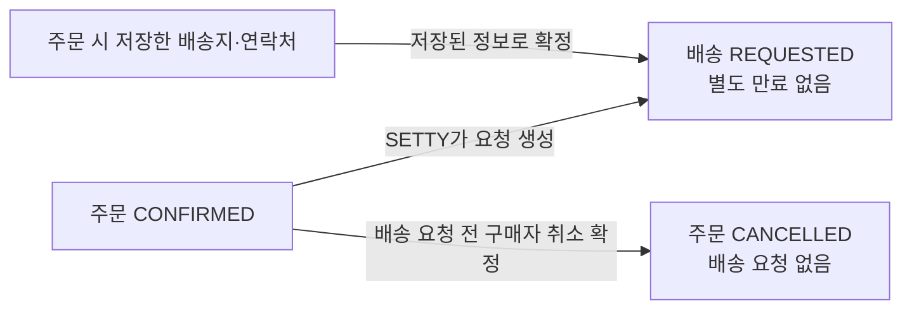
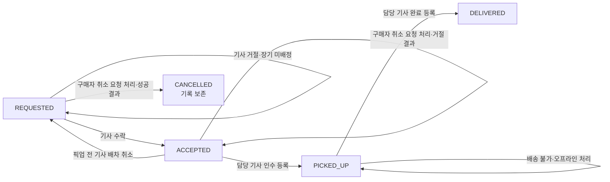

# 배송 정책

배송 요청의 생성·배정과 배송 상태 변화를 정의한다. 주문 취소의 허용 조건은 [주문·매물 정책](order.md#취소)을 따른다.

## 상태 목록

- 배송: `REQUESTED`, `ACCEPTED`, `PICKED_UP`, `DELIVERED`, `CANCELLED`.
- 배송 요청이 없는 동안에는 배송 상태값도 없다.

## 목차

- [요청·정보 확정](#요청정보-확정)
- [배송 상태 전이](#배송-상태-전이)
- [확인 필요](#확인-필요)
- [후순위 정책](#후순위-정책)

## 요청·정보 확정

- SETTY는 주문이 `CONFIRMED`가 된 후 배송 요청을 별도 흐름에서 생성한다. 생성 실패가 주문 확정에 미치는 영향은 [결제 정책](payment.md#승인재시도)을 따른다.
- 배송 요청이 아직 없거나 생성에 실패한 확정 주문도 구매자가 취소할 수 있다. 주문 취소가 확정되면 해당 주문의 배송 요청은 생성하지 않는다.
- 주문 시점의 배송지와 연락처를 저장하고, 배송 요청 생성 시 그 정보를 확정한다. 이후 회원정보 변경은 기존 주문과 배송 요청에 반영하지 않는다.
- 배송 요청은 별도의 만료 시간이 없다. 기사 수락이나 허용된 구매자 취소 전까지 `REQUESTED`를 유지한다.

## 배송 상태 전이

배송 요청이 없는 동안에는 배송 상태값도 없다. 주문의 `CANCEL_PENDING`은 배송 상태값이 아니다.

| 현재 배송 상태 | 조건 | 다음 배송 상태 | 결과 |
| --- | --- | --- | --- |
| 배송 요청 없음 | `CONFIRMED` 주문의 배송 요청 생성 | `REQUESTED` | 별도 만료 없이 배차 대기 |
| `REQUESTED` | 기사 거절 또는 장기 미배정 | `REQUESTED` 유지 | 배차 대기 유지 |
| `REQUESTED` | 기사 한 명이 수락 | `ACCEPTED` | 배차 확정 |
| `ACCEPTED` | 픽업 전 담당 기사가 배차 취소 | `REQUESTED` | 다시 배차 대기 |
| `ACCEPTED` | 담당 기사가 인수 등록 | `PICKED_UP` | 배송 진행 |
| `PICKED_UP` | 담당 기사가 배송 완료 등록 | `DELIVERED` | 배송 완료 |
| `REQUESTED` | 구매자 주문 취소 요청 처리 | `CANCELLED` | 배송 요청 보존, 취소 성공 결과를 주문에 알림 |
| `ACCEPTED`, `PICKED_UP`, `DELIVERED` | 구매자 주문 취소 요청 처리 | 기존 상태 유지 | 취소 거절 결과를 주문에 알림 |
| `PICKED_UP` | 픽업 후 배송 불가 | `PICKED_UP` 유지 | 운송원 책임으로 오프라인 처리 |

배송 취소 가능 여부는 요청 접수 시점이 아니라 배송이 취소 요청을 처리할 때의 상태로 결정한다. 기사 수락과 구매자 취소가 동시에 요청되면 먼저 확정된 상태 변경만 성공한다.

픽업 후 배송이 불가능해지면 운송원의 책임으로 오프라인에서 처리하고 시스템 상태는 `PICKED_UP`을 유지한다. 배송 실패와 일정 변경은 현재 서비스에서 다루지 않는다. `DELIVERED` 이후 판매 완료 시점은 [판매 완료·정산 정책](completion-settlement.md)을 따른다.

## 확인 필요

- 토스 승인 후 주문이 `CONFIRMED`가 되었으나 배송 요청 생성에 실패한 경우의 복구와 고객에게 보일 상태를 정해야 한다. 이 경우 구매자 취소는 허용한다.

## 후순위 정책

- 배송기사 자격 검증 세부 기준
- 배송 요청 노출 기준
- 배송 완료 사진 등 증빙 기준
