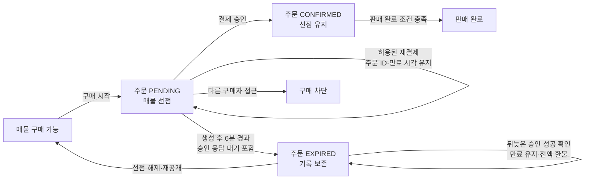
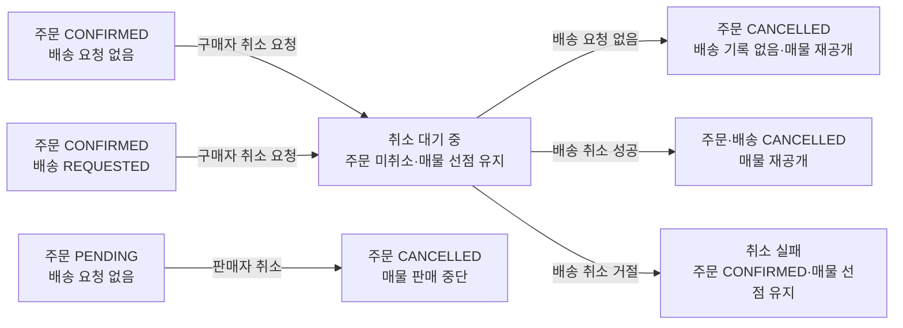

# 주문·매물 정책

구매 시작부터 판매 완료 전까지의 주문 상태와 매물 점유를 정의한다. 결제 승인과 환불은 [결제 정책](payment.md), 배송 요청과 상태는 [배송 정책](delivery.md)을 따른다.

## 주문 생성·매물 점유

- 결제 전에 주문을 `PENDING`으로 생성하고, 해당 매물을 선점한다. 다른 구매자의 구매는 차단한다.
- `orderStatus`와 `deliveryStatus`는 별개의 상태다.
- 결제 승인으로 주문이 `CONFIRMED`가 된 뒤에도 [판매 완료 조건](completion-settlement.md)이 충족될 때까지 매물 선점을 유지한다. 취소에 따른 선점 종료는 [취소 정책](#취소)을 따른다.

## 만료·재결제

- `PENDING` 주문은 생성 시점부터 6분이 지나면 `EXPIRED`가 된다. 결제 승인 응답을 기다리는 중에도 만료를 보류하지 않는다.
- 만료 후 결제 승인 성공이 확인되더라도 주문은 `EXPIRED`를 유지하고 매물은 다시 구매 가능한 상태로 둔다. 승인된 결제의 처리는 [환불 정책](payment.md#환불)을 따른다.
- 같은 구매자가 재결제할 때는 기존 주문 ID를 사용하고 만료 시각을 연장하지 않는다. 승인 요청이 진행 중이거나 결제 결과가 `UNKNOWN`이면 [결제 정책](payment.md)에 따라 재결제를 차단한다.
- `EXPIRED` 주문은 삭제하지 않고 보존한다. 매물 선점을 해제하고 다시 구매 가능한 상태로 전환한다.
- 결제 결과가 불명확한 상태에서 만료된 뒤에도 최종 결제 결과가 확인되지 않는 경우는 [결제 정책의 확인 필요 항목](payment.md#확인-필요)을 따른다.

## 취소

| 주체 | 허용 조건 | 주문·배송 기록 | 매물 |
| --- | --- | --- | --- |
| 판매자 | 결제 전 주문이 `PENDING`이고 배송 요청이 없을 때 | 주문을 `CANCELLED`로 보존 | 판매 중단 |
| 구매자 | 주문이 `CONFIRMED`이고 취소 판단 시 배송 요청이 없을 때 | 주문을 `CANCELLED`로 보존하고 배송 기록은 만들지 않음 | 취소 확정 후 다시 구매 가능 |
| 구매자 | 주문이 `CONFIRMED`이고 배송 취소 요청 처리 시 상태가 `REQUESTED`일 때 | 배송 취소 성공 후 주문과 배송 요청을 각각 `CANCELLED`로 보존 | 취소 확정 후 다시 구매 가능 |

- 판매자 취소가 허용 조건에서 먼저 확정되면 뒤늦은 결제 승인 성공으로 주문 취소와 매물 판매 중단을 되돌리지 않는다. 승인된 결제의 처리는 [환불 정책](payment.md#환불)을 따른다.
- 구매자 취소 요청을 접수하면 **취소 대기 중** 결과를 즉시 반환한다. 취소 대기는 결제 전 주문의 `PENDING`과 구별한다. 취소가 확정되기 전까지 주문은 취소되지 않으며 매물 선점을 유지한다.
- 배송 요청이 없으면 주문 취소를 확정한다. 배송 요청이 `REQUESTED`이면 배송 취소에 성공한 뒤 주문 취소를 확정한다. 배송 요청이 `ACCEPTED` 이후라 취소가 거절되면 주문 취소는 실패하며 주문의 `CONFIRMED` 상태와 매물 선점을 유지한다.
- 주문 취소가 확정되어 승인된 결제가 있다면 [환불 정책](payment.md#환불)을 따른다. 주문 취소 확정과 환불 완료는 별개의 결과다.

배송 요청이 아직 생성되지 않았거나 생성에 실패한 주문에도 구매자 취소를 허용한다. 배송 요청 생성 실패의 복구와 고객 표시 기준은 [배송 정책의 확인 필요 항목](delivery.md#확인-필요)에 남겨 둔다.

## 확인 필요

- 배송 취소에는 성공했지만 주문이 취소 확정 결과를 반영하지 못한 경우의 재처리와 고객 표시 기준을 정해야 한다.

## 후순위 정책

- 거래 가능한 품목과 매물 등록 기준
