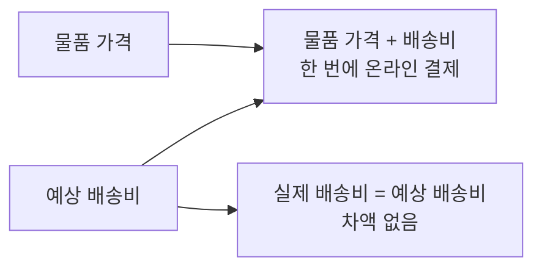
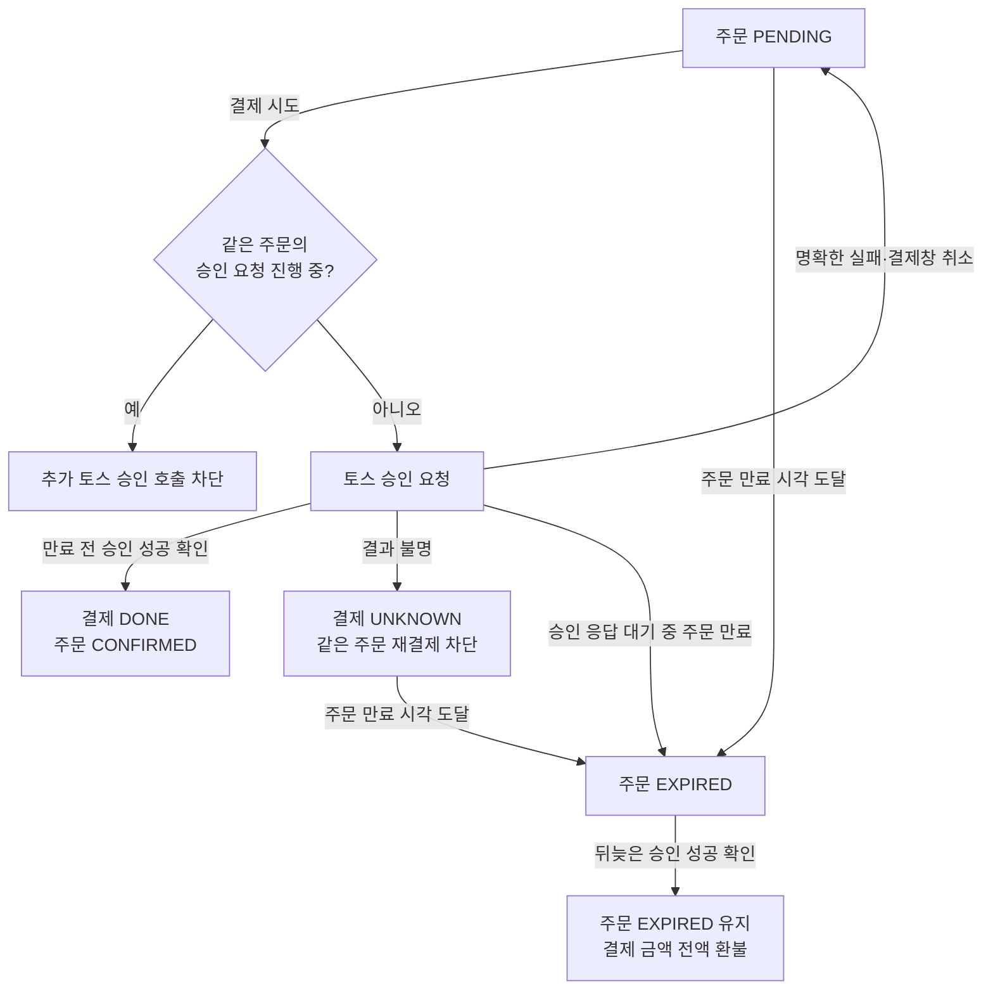
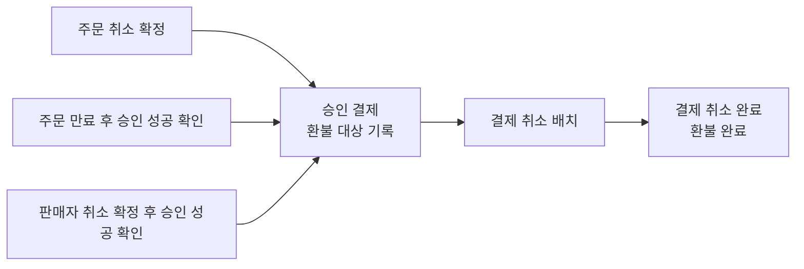

# 결제 정책

결제 금액, 승인 결과와 환불을 정의한다. 주문의 만료와 취소 조건은 [주문·매물 정책](order.md)을 따른다.

## 상태 목록

- 결제: `UNKNOWN`, `DONE`.
- 승인 전·결제창 취소·명확한 승인 실패에는 이름 붙인 결제 상태값이 없다. 환불 대상 기록과 결제 취소 완료에 대응하는 결제 상태값은 미정이다.

## 목차

- [결제 금액](#결제-금액)
- [승인·재시도](#승인재시도)
- [결과 미확정](#결과-미확정)
- [환불](#환불)
- [결제 상태 전이](#결제-상태-전이)
- [확인 필요](#확인-필요)
- [보류](#보류)
- [후순위 정책](#후순위-정책)

## 결제 금액

- 물품 가격과 예상 배송비를 합산하여 한 번에 온라인 결제한다.
- 실제 배송비는 예상 배송비와 같다. 배송비 차액은 발생하지 않는다.

## 승인·재시도

- 주문이 만료되거나 취소되기 전에 토스 승인 성공이 확인되면 결제를 `DONE`, 주문을 즉시 `CONFIRMED`로 확정한다.
- 주문 만료 또는 허용된 판매자 취소가 먼저 확정된 뒤 승인 성공이 확인되면 [주문 정책](order.md)에 따른 주문·매물 상태를 유지하고 결제 금액 전액을 환불한다.
- 배송 요청 생성은 주문 확정 이후 별도 흐름으로 처리한다. 배송 요청 생성이 실패해도 주문 확정을 되돌리지 않는다.
- 결제창 취소 또는 명확한 승인 실패 후에도 기존 주문을 원래 만료 시각까지 `PENDING`으로 유지한다. 만료 시각은 [주문·매물 정책](order.md#만료재결제)을 따른다.
- 같은 주문의 중복 승인 요청은 토스 승인 API 호출 전에 차단한다.

## 결과 미확정

- 결제 결과가 불명확하면 결제를 `UNKNOWN`으로 두고 같은 주문의 재결제를 차단한다.
- 그 밖의 후속 정책은 아직 정하지 않았다. 미정인 범위는 [확인 필요](#확인-필요)에 기록한다. 주문 만료 기준은 [주문·매물 정책](order.md#만료재결제)을 따르고, 만료 후 승인 성공이 확인됐을 때의 [환불 정책](#환불)은 유지한다.

## 환불

- 환불은 주문 취소 확정 또는 만료 후 뒤늦게 확인된 승인에 의해 발생한다. 주문 취소 확정 이벤트를 받은 결제 영역은 해당 주문의 승인된 결제를 환불 대상으로 기록한다.
- 기록된 환불 대상은 배치에서 결제 취소를 처리한다. 결제 취소가 완료되면 구매자에게 결제 금액이 환불된다. 주문 취소 확정은 환불 완료를 뜻하지 않는다.
- 판매자 취소는 결제 전 주문에만 허용된다. 판매자 취소 확정 후 뒤늦게 결제 승인이 확인되면 승인 금액 전액을 환불한다.

## 결제 상태 전이

표의 `—`는 현 정책에 이름 붙인 결제 상태값이 없는 단계다. 결제창 취소와 명확한 승인 실패에 대응하는 별도 상태값은 현 정책에 명시되지 않았다.

| 현재 결제 상태 | 조건 | 다음 결제 상태 | 결과 |
| --- | --- | --- | --- |
| `—` | 승인 성공 확인 | `DONE` | 주문이 유효하면 `CONFIRMED`, 만료·판매자 취소가 먼저 확정되었으면 전액 환불 대상 |
| `—` | 결제 결과 불명확 | `UNKNOWN` | 같은 주문의 재결제 차단 |
| `—` | 결제창 취소 또는 명확한 승인 실패 | `—` | 주문은 원래 만료 시각까지 `PENDING` 유지 |
| `UNKNOWN` | 최종 승인 성공 확인 | `DONE` | 주문의 만료·판매자 취소 여부에 따라 확정 또는 전액 환불 |
| `DONE` | 같은 주문의 승인 재요청 | `DONE` 유지 | 중복 승인 차단 |

승인 결제의 환불 대상 기록과 결제 취소 완료는 [환불](#환불)에서 정의한다. 각 결과에 대응하는 결제 상태값은 [확인 필요](#확인-필요)에 기록한다.

## 확인 필요

- 결제 결과가 불명확한 상황(`UNKNOWN`)에서 같은 주문의 재결제 차단 외 처리 정책은 아직 정하지 않았다. 최종 실패가 확인된 경우의 상태 전이, 주문 만료 후 동일 구매자의 신규 구매, 고객 표시, 결과 미확정이 지속될 때의 처리 기준을 정해야 한다.
- 환불 배치의 처리 주기, 결제 취소 실패·결과 미확정 시 재처리 기준과 고객에게 표시할 상태를 정해야 한다.
- 환불 대상 기록과 결제 취소 완료를 결제 상태값으로 표현할지, 표현한다면 어떤 상태값을 사용할지 정해야 한다.

## 보류

- 토스 승인 후 SETTY 내부 저장 실패의 복구 방법
- 자동 승인 취소 실패의 후속 처리

## 후순위 정책

- 예상 배송비 산정·변경 기준
