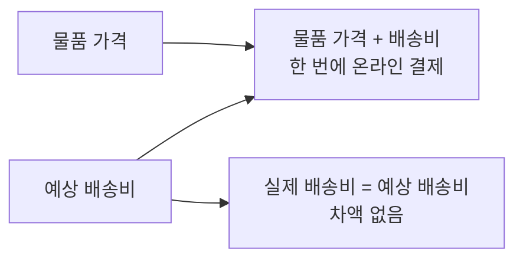
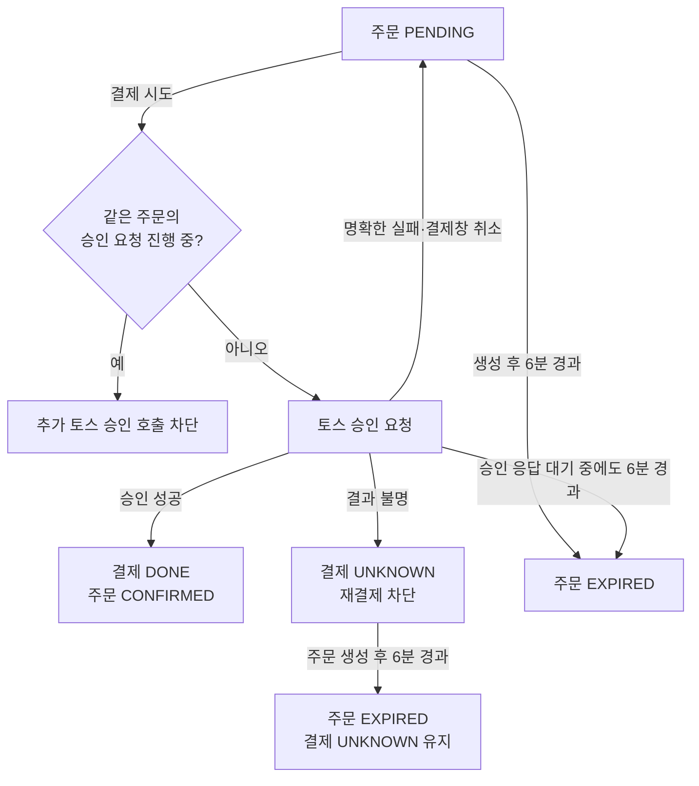

# 결제 정책

결제 금액, 승인 결과와 환불을 정의한다. 주문의 만료와 취소 조건은 [주문·매물 정책](order.md)을 따른다.

## 결제 금액

- 물품 가격과 예상 배송비를 합산하여 한 번에 온라인 결제한다.
- 실제 배송비는 예상 배송비와 같다. 배송비 차액은 발생하지 않는다.

## 승인·재시도

- 토스 승인 성공 후 결제를 `DONE`, 주문을 즉시 `CONFIRMED`로 확정한다.
- 배송 요청 생성은 주문 확정 이후 별도 흐름으로 처리한다. 배송 요청 생성이 실패해도 주문 확정을 되돌리지 않는다.
- 결제창 취소 또는 명확한 승인 실패 후에도 기존 주문을 원래 만료 시각까지 `PENDING`으로 유지한다. 재결제 가능 조건과 6분 만료는 [주문·매물 정책](order.md#만료재결제)을 따른다.
- 같은 주문의 중복 승인 요청은 토스 승인 API 호출 전에 차단한다.

## 결과 미확정

- 결제 결과가 불명확하면 결제를 `UNKNOWN`으로 두고 재결제를 차단한다.
- 구매자에게 표시할 문구는 [고객 상태·알림 정책](customer-status.md)을 따른다.
- `UNKNOWN` 상태에서 주문이 만료되거나 뒤늦은 승인이 확인된 경우의 처리는 아래 확인 필요 항목에 남겨 둔다.

## 환불

- 환불은 주문 취소에 의해 발생한다. 승인된 결제가 있는 주문이 취소되면 구매자에게 결제 금액을 환불한다.
- 판매자는 결제 전 주문만 취소할 수 있으므로 판매자 취소에는 환불할 승인 결제가 없다.

## 확인 필요

- 결제 결과가 `UNKNOWN`인 채 주문 생성 후 6분이 지나면 주문은 만료되고 매물 점유가 해제된다. 이후 토스 승인이 확인될 때 결제·주문·매물의 최종 상태를 어떻게 맞출지 확인이 필요하다.

## 잠정 채택

- 주문 만료 후 토스 승인이 확인되면 자동 승인 취소를 요청한다.

## 보류

- 토스 승인 후 SETTY 내부 저장 실패의 복구 방법
- 자동 승인 취소 실패의 후속 처리

## 후순위 정책

- 예상 배송비 산정·변경 기준
