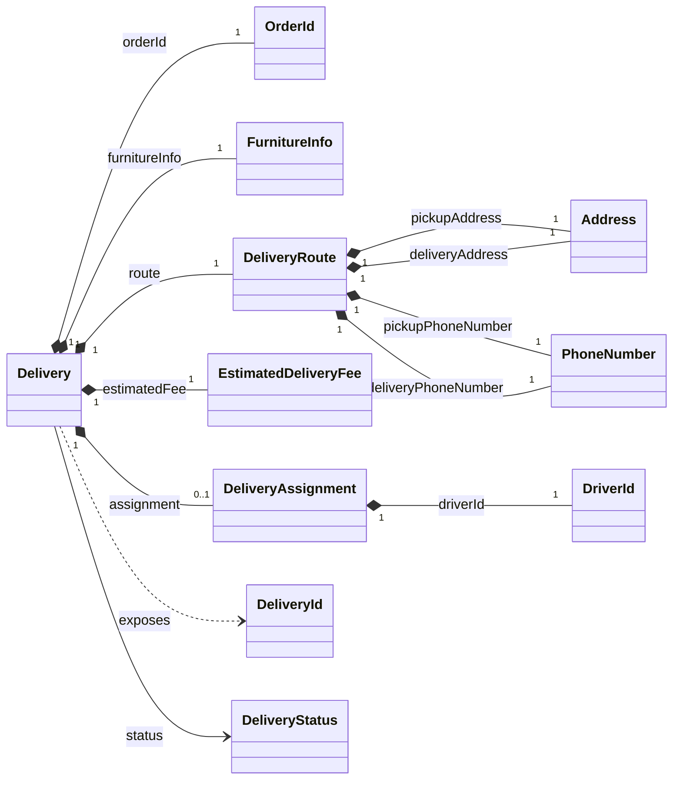

# 배송 도메인 설계

배송 도메인의 객체, 관계, 상태와 불변식을 정의한다. 설계 결정의 맥락과 대안은 ADR에서 관리한다.

[문서 인덱스](README.md) · [모듈 구조](module-architecture.md) · [ADR-0001](adr/0001-delivery-aggregate-boundary.md)

## 1. 유비쿼터스 언어

| 한국어 | 코드 어휘 | 의미 |
|---|---|---|
| 배송 | `Delivery` | 주문된 가구를 출발지에서 도착지까지 운송하는 단위 |
| 배송 요청 | `REQUESTED` | 아직 기사에게 배정되지 않은 최초 상태 |
| 배송 수락 | `accept` / `ACCEPTED` | 기사가 배송을 맡고 수락 시각을 기록한 상태 |
| 가구 수령 | `pickUp` / `PICKED_UP` | 담당 기사가 출발지에서 가구를 인수한 상태 |
| 배송 완료 | `complete` / `DELIVERED` | 담당 기사가 도착지에 가구를 전달한 상태 |
| 배송 배정 | `DeliveryAssignment` | 담당 기사와 수락 시각의 조합 |
| 배송 경로 | `DeliveryRoute` | 출발지·도착지의 주소와 연락처 조합 |
| 가구 정보 | `FurnitureInfo` | 가구명과 카테고리 조합 |
| 예상 배송비 | `EstimatedDeliveryFee` | 배송 생성 시 확정되는 0 이상의 예상 비용 |

용어는 상태와 행위를 함께 맞춘다. 수락은 `accept`, 수령은 `pickUp`, 완료는 `complete`만 사용한다.

## 2. Aggregate 경계

`Delivery`가 배송 핵심 도메인의 Aggregate Root다.

- 상태 전이는 `Delivery`만 수행한다.
- Order는 `OrderId`로만 참조한다.
- 담당 기사는 `DeliveryAssignment`의 `DriverId`로만 참조한다.
- Order와 기사 계정은 Delivery Aggregate 내부 객체가 아니다.
- `DeliveryAssignment`는 수락 전에는 존재하지 않고 수락 시 완전한 값으로 생성된다.
- `DeliveryMember`는 기사 인증 하위 도메인의 별도 Aggregate Root다.

Aggregate 경계와 ID 참조를 선택한 근거는 [ADR-0001](adr/0001-delivery-aggregate-boundary.md)에 기록한다.

### 객체 관계



## 3. Value Object

| 객체 | 구성 | 불변식 |
|---|---|---|
| `DeliveryId` | `Long value` | 양수 |
| `OrderId` | `Long value` | 양수 |
| `DriverId` | `Long value` | 양수 |
| `FurnitureInfo` | `itemName`, `category` | null·blank 불가, 앞뒤 공백 제거 |
| `Address` | `String value` | null·blank 불가, 앞뒤 공백 제거 |
| `PhoneNumber` | `String value` | null·blank 불가, 앞뒤 공백 제거 |
| `DeliveryRoute` | 주소 2개, 연락처 2개 | 모든 구성요소 필수 |
| `EstimatedDeliveryFee` | `Integer value` | null·음수 불가 |
| `DeliveryAssignment` | `DriverId`, `acceptedAt` | 두 값 모두 필수 |

VO는 생성 후 변경하지 않는다. 형식 검증과 필수 조합 검증은 각 VO 생성자가 수행한다.

전화번호는 배송 연락처라는 의미와 필수 여부만 보장한다. 국가별 형식을 가정하는 과도한 정규식은 두지 않는다.

## 4. Delivery 상태 모델

```text
REQUESTED → ACCEPTED → PICKED_UP → DELIVERED
```

| 현재 상태 | 명령 | 다음 상태 | 추가 규칙 |
|---|---|---|---|
| 생성 전 | `Delivery.request(...)` | `REQUESTED` | 필수 VO와 요청 시각 필요 |
| `REQUESTED` | `accept(driverId, acceptedAt)` | `ACCEPTED` | 기사와 수락 시각을 함께 기록 |
| `ACCEPTED` | `pickUp(driverId, pickedUpAt)` | `PICKED_UP` | 담당 기사만 가능 |
| `PICKED_UP` | `complete(driverId, deliveredAt)` | `DELIVERED` | 담당 기사만 가능 |

다음 전이는 허용하지 않는다.

- 이미 수락된 Delivery 재수락
- `REQUESTED`에서 바로 수령 또는 완료
- `ACCEPTED`에서 바로 완료
- 담당 기사가 아닌 기사의 수령 또는 완료
- 이전 상태로의 역전이

상태와 상태별 시각은 하나의 도메인 연산에서 함께 변경한다.

## 5. Order 배송 상태의 소유권

Order의 배송 상태와 동기화 규칙은 플랫폼의 `Order`가 소유한다. 배송 도메인은 별도 Order 상태 모델을 두지 않고 `OrderId`로만 참조한다.

| 새 상태 | 기대하는 현재 상태 |
|---|---|
| `ACCEPTED` | `REQUESTED` |
| `PICKED_UP` | `ACCEPTED` |
| `DELIVERED` | `PICKED_UP` |

- 현재 상태가 새 상태와 같으면 이미 반영된 것으로 보고 변경하지 않는다.
- 현재 상태가 기대 이전 상태면 새 상태로 변경한다.
- 두 상태 모두 아니면 상태 불일치로 거부한다.
- `REQUESTED`로 되돌리는 동기화는 허용하지 않는다.

Delivery와 Order 상태를 연결하는 실행 구조는 [모듈 구조](module-architecture.md)와 [ADR-0004](adr/0004-platform-jpa-order-status-sync.md)에 기록한다.

## 6. 식별자와 시간

- 신규 Delivery는 영속화 전 식별자가 없을 수 있다.
- 영속화된 내부 식별자는 `DeliveryId`로 표현한다.
- `OrderId`, `DeliveryId`, `DriverId`는 같은 원시 타입이어도 서로 대체할 수 없다.
- 한 Order에는 하나의 Delivery만 존재해야 한다.
- Domain은 현재 시각을 직접 조회하지 않는다.
- 요청·수락·수령·완료 시각은 도메인 연산의 인자로 받는다.

단순 record VO는 구성 값 기반 동등성을 사용한다. `DeliveryRoute`와 `DeliveryAssignment`도 전체 구성 값으로 동등성을 판단한다. `Delivery`는 현재 별도 동등성 정책을 정의하지 않는다.

## 7. 비범위

현재 배송 도메인 모델에 다음 개념은 없다.

- 배송 취소와 반품
- 재배정과 수락 취소
- 배차 최적화
- GPS와 실시간 위치
- 기사 정산
- 외부 운송사 연동

새 개념이 필요하면 기존 상태 전이에 억지로 끼워 넣지 않고 별도 도메인 결정과 ADR을 먼저 작성한다.
